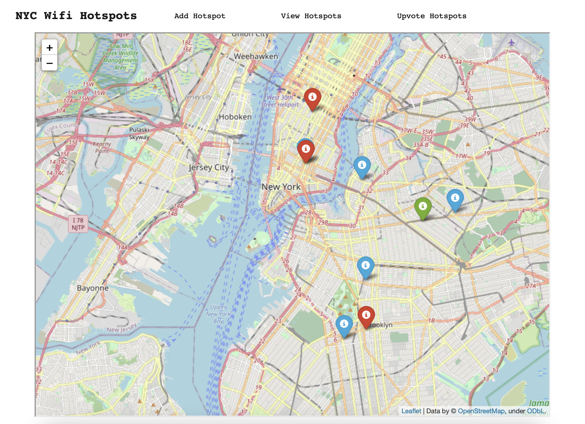
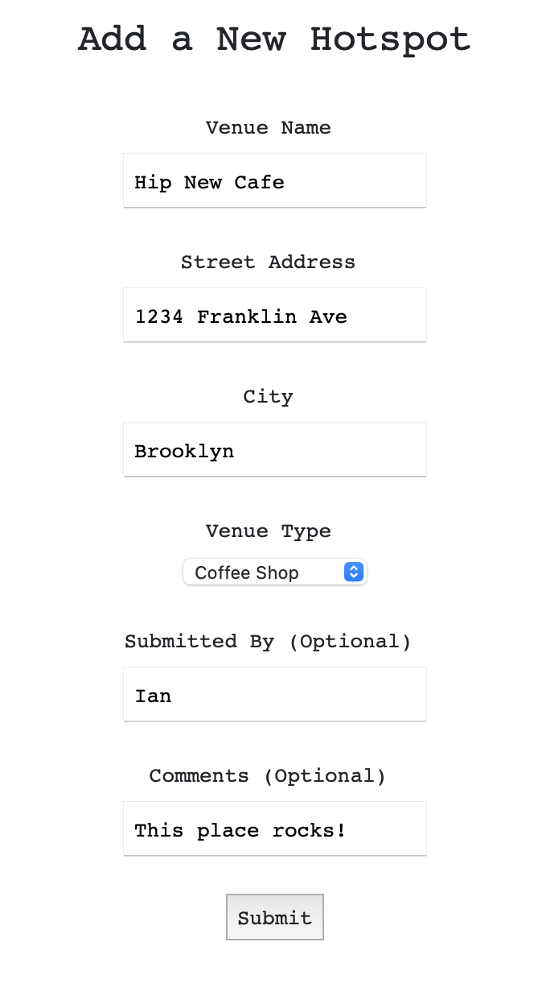
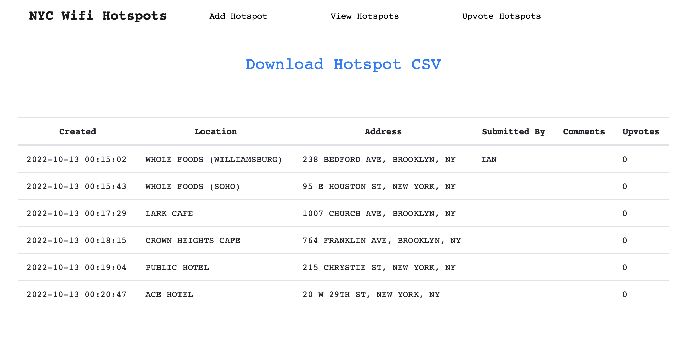

# New York Wifi Map

This project is a quick and dirty means of tracking quality WiFi hotspots in New York City

## Usage Notes

* Hotspots are color-coded by venue type (bar / coffee shop / hotel lobby)
  
* Users can submit new hostpots on the `/add_hotspot` route, which immediately populates a new HTML rendering of the map to display
    

* You can view all submitted hotspots on the `/view_hotspots` route ... where you can also request a downloaded CSV!
    